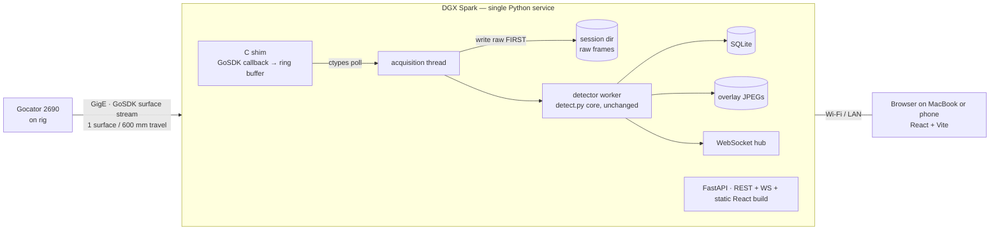
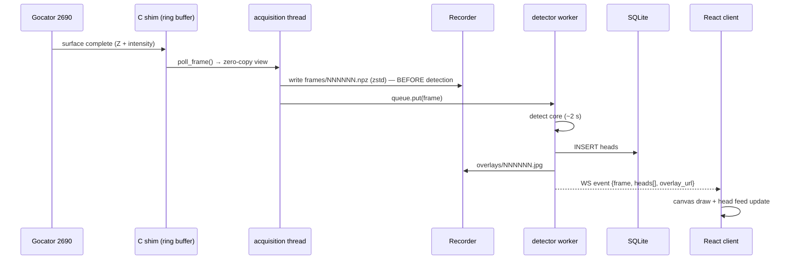
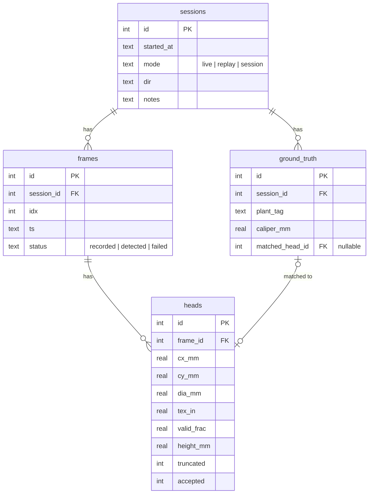

# Live Pipeline Architecture (Approach A)

Status: **approved design, pre-implementation** · 2026-08-19
Scope: v1 = field **validation campaign** tool — scan rows live, see detections, enter caliper ground truth, get an accuracy report. Recording is first-class; operation-at-scale is explicitly out of scope for v1 (see [decisions.md](decisions.md)).

## System context



Deployment: one systemd unit (`Restart=always`) on the Spark. The browser needs nothing installed — the service serves the built frontend.

Timing budget: a 600 mm surface takes ≥ 3 s to acquire at walking speed; detection takes ~2 s on CPU. Single detector worker keeps up with a safety margin. No GPU in the loop.

## The one interface that matters: FrameSource

Everything downstream of acquisition consumes this and only this:

```python
class Frame(TypedDict):
    z16: np.ndarray        # int16 heightmap (H, W), 0x8000 invalid
    intensity: np.ndarray  # uint8 (H, W), pixel-aligned with z16
    stamp: Stamp           # frame index, timestamp, source id

class FrameSource(Protocol):
    def frames(self) -> Iterator[Frame]: ...
    def health(self) -> SourceHealth: ...
```

| Implementation | Backed by | Purpose |
|---|---|---|
| `ReplaySource` | `rec_reader.py` (exists) | Offline analysis of `.rec` files — **also the development source**: real sensor data through the real code path |
| `LiveSource` | C shim + ctypes | Field acquisition |
| `SessionSource` | recorded session dir | Re-run any past session through improved detectors |

No simulated source exists. `ReplaySource` is real captured data, so a timer-paced fake would add a class to maintain and prove nothing extra (D10).

This boundary is the promise that Approach A → Approach B (split acquisition daemon) later is a process split, not a rewrite: `LiveSource` becomes an IPC client and nothing else changes.

## Live data flow



Rule enforced in code and tests: **raw write precedes detection**. A detector exception marks the frame `failed` in SQLite and the pipeline continues; the raw frame is already safe.

## Module layout

```
backend/
  app/
    main.py          # FastAPI assembly, lifespan wiring
    sources.py       # FrameSource protocol + Replay/Session/FakeLive
    acquisition/
      gocator_shim.c # GoSDK callback → preallocated SPSC ring (8 × 41 MB slots)
      Makefile       # builds libgocator_shim.so on the Spark (aarch64)
      live.py        # LiveSource: ctypes binding + reconnect loop
    detector.py      # wraps the existing detect core; worker loop
    recorder.py      # session dirs, zstd npz frames, meta.json
    store.py         # SQLite schema + queries
    api.py           # REST routes
    ws.py            # WebSocket hub (fan-out, reconnect-safe)
  tests/
frontend/            # React + Vite + Tailwind
  src/
    pages/Live.tsx        # canvas overlay, head feed, counters, GT quick-entry
    pages/Sessions.tsx    # session list
    pages/Session.tsx     # contact-sheet grid, head table, validation report
    lib/ws.ts             # one reconnecting WS hook
    lib/api.ts            # typed fetch wrappers
rec_reader.py        # .rec format (see docs/rec-format.md)
detect.py            # detection core + selftest (shared by all sources)
```

`detect.py` stays at repo root and dependency-free of the backend — it is the shared core, importable by the service and runnable standalone exactly as today.

## Recording format (session directory)

```
data/
  gocator.sqlite                     # one DB for all sessions
  sessions/2026-08-21_1032_row-a/
    meta.json                        # sensor config snapshot, resolutions, notes, source type
    frames/000042.npz                # z16 (int16) + intensity (uint8), zstd level 3
    overlays/000042.jpg
```

~15–25 MB per frame compressed → ~1–2 GB per field pass. Disk-space check (≥ 5 GB free) gates session start. `SessionSource` reads this layout back; `meta.json` carries everything needed to reprocess without the original sensor.

## Data model



Ground-truth matching is **manual and explicit**: in the UI you tap a detected head and assign it `plant_tag` + `caliper_mm`. No fuzzy auto-matching in v1 — zero ambiguity in the validation numbers.

## API surface

REST (all JSON):

| Route | Purpose |
|---|---|
| `POST /api/sessions` | start a session `{mode: live\|replay\|session, source, notes}` |
| `POST /api/sessions/{id}/stop` | stop + finalize |
| `GET /api/sessions` / `GET /api/sessions/{id}` | list / detail with head stats |
| `GET /api/sessions/{id}/heads` | all heads (the CSV, as JSON) |
| `GET /api/frames/{id}/overlay.jpg` | annotated frame |
| `POST /api/ground-truth` | `{session_id, head_id, plant_tag, caliper_mm}` |
| `GET /api/sessions/{id}/validation` | paired ours-vs-caliper rows + MAE / bias / max error |
| `GET /api/health` | sensor state, frames/min, queue depth, dropped frames, disk free |

WebSocket `/ws` events: `session_state`, `frame_processed` (with heads + overlay URL), `sensor_health`. Events are fire-and-forget; the UI reconciles via REST on reconnect.

## Frontend (React + Vite + Tailwind)

Three pages, one WS hook:

- **Live** — the field-day screen: latest overlay on a canvas, rolling head feed (diameter, confidence), big counters (heads this session, mean dia, frames/min), sensor health strip, and tap-a-head → ground-truth entry (plant tag + caliper mm, numeric keypad friendly).
- **Sessions** — past sessions with head counts and validation status.
- **Session detail** — contact-sheet grid of head crops, sortable head table, and the **validation report**: scatter of pipeline vs caliper, MAE / bias / worst-case, per-plant table. This page is the deliverable of the campaign.

Phone-first layout for Live (you'll hold a phone in the field); desktop-first for Session detail.

## Error handling & field robustness

| Failure | Behavior |
|---|---|
| Sensor disconnect | `LiveSource` reconnect loop with backoff; UI shows sensor state; session stays open |
| Detector exception | frame marked `failed`, raw already on disk, pipeline continues |
| Service crash | systemd restarts; open session is recovered from disk on boot (frames present, not yet detected → re-queued) |
| Ring buffer overflow (detector too slow) | oldest undetected frames skipped for *detection* but still recorded; drop count in `/api/health` |
| Disk low | session start refused below 5 GB free; live warning below 10 GB |
| Browser disconnect | WS hook reconnects; state rebuilt from REST |

## Testing

- `detect.py --selftest` stays the core's guard (synthetic 200 mm disc, < 5 % error).
- **Golden replay test**: `ReplaySource` over committed downsampled fixture frames must reproduce known head counts/diameters — the regression net for any detector change.
- Unit: recorder round-trip (write → `SessionSource` read → identical arrays), store queries, validation math.
- **Full-stack check**: a `ReplaySource` session drives recorder → detector → store → WS → UI end to end with real data; only acquisition is untested until the sensor streams.
- C shim tested against the Gocator emulator/accelerator (in repo: `Emulator and Accelerator/`) before first field connection.

## What v1 deliberately does not do

Multi-sensor, auth, cloud sync, auto GT matching, encoder integration, ML quality grading (signals are logged for it — see the [quality section of the overview artifact](https://claude.ai/code/artifact/b488618a-8ace-4a57-b2a2-81c8f9671adc)), and Approach B's split daemon. Each has a clean seam to grow into.
